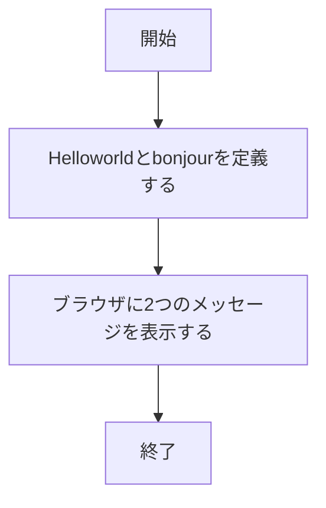
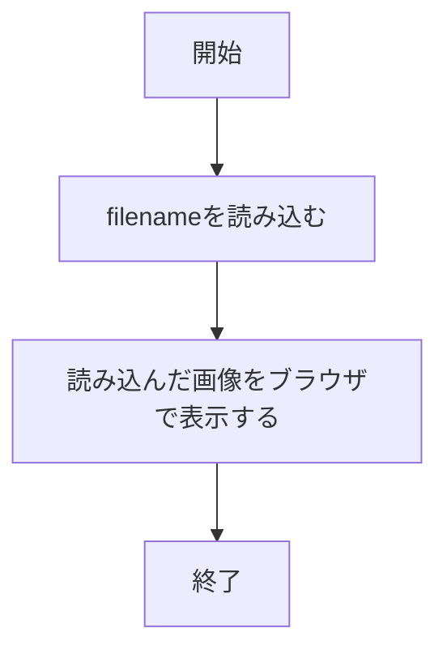
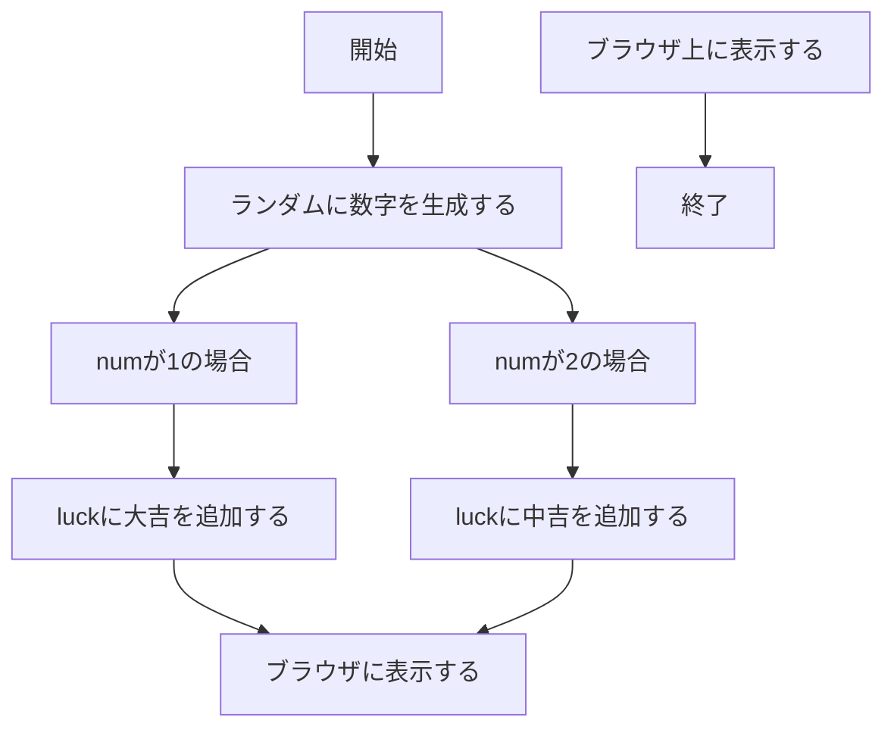
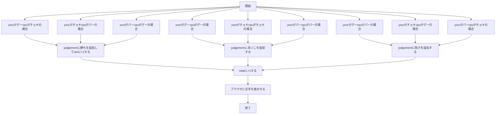
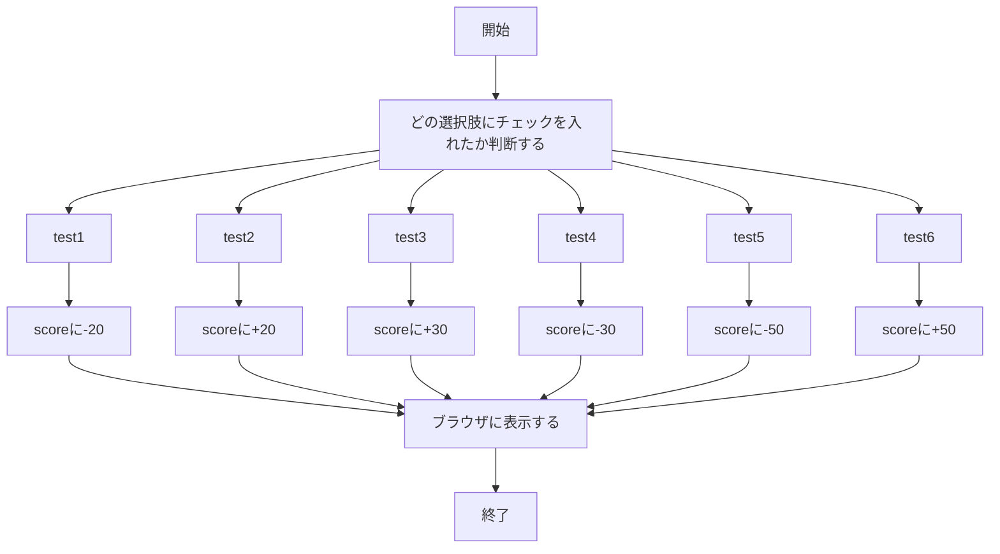
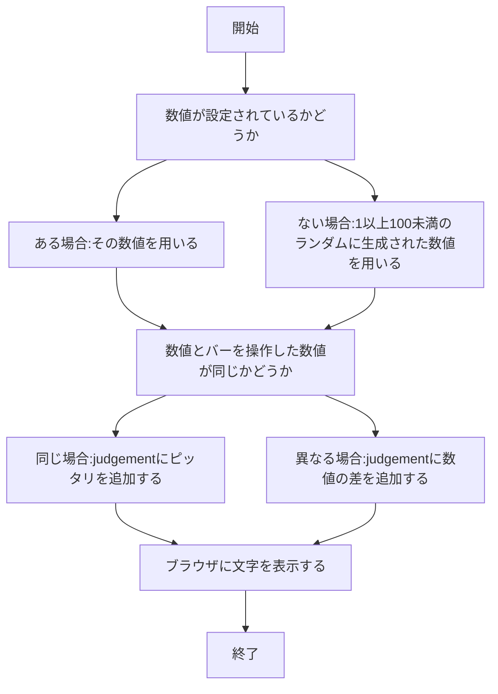

# webpro_06

# #作成したファイルについて
作成したファイルは，
　・question.html
　・question.ejs
　・number.html
　・number.ejs
の以上4つだ．

# #ファイル一覧

ファイル名 | 説明
-|-
app5.js | プログラム本体
public/question.html | 出された問題の選択肢を選ぶ画面
question.ejs |　回答の結果と答えを表示する画面
public/number.html | 開始画面
number.ejs | 指定された数字の位置にバーを動かすための画面
janken.html | じゃんけんでなんの手を出すかを決めるための画面
janken.ejs | じゃんけんの結果の判決，試合数と勝ちの総数を表示する画面
luck.ejs | 運勢とデバック用の数字を表示する画面
icon.ejs | アップルのアイコンを表示する画面
show.ejs | ２つの挨拶を表示する画面


# #作成したファイルの起動方法
・question.html
ターミナルで作業ディレクトリをwebpro_06に移動し，
```
node app5.js
```
を入力し，サーバーを起動する．
そして，ブラウザで
```
http://localhost:8080/public/question.html
```
と入力することで起動することができる．

・number.html
ターミナルで作業ディレクトリをwebpro_06に移動し，
```
node app5.js
```
を入力し，サーバーを起動する．
そして，ブラウザで
```
http://localhost:8080/public/number.html
```
と入力することで起動することができる．

# #app5.jsにもともとあったプログラムについて
・/hello1
　２つのメッセージ，"Hello world"と"bon jour"を定義し，show.ejsでメッセージを表示するプログラムになっている．定義は以下のようにしている．
```
const message1="Hello world";
const message2="bon jour";
```
そして定義した２つのメッセージとres.renderを用いて，以下のようになっている．
```
res.render('show', { greet1:message1, greet2:message2});
```
これらのメッセージはshow.ejsの
```
<%= greet1 %>
<%= greet2 %>
```
の部分で表示される．
以下は上記のプログラムの流れをフローチャートにしたものだ．



・/hello2
　2つのメッセージ，"Hello world"と"bon jour"をres.renderの中に直接定義して，show.ejsでメッセージを表示するプログラムになっている．
res.renderの定義は以下のようになっている．
```
res.render('show', { greet1:"Hello world", greet2:"Bon jour"});
```
以下は上記のプログラムの流れをフローチャートにしたものだ．


・/icon
　res.render内のfilenameで指定されたリンクから画像を検索し，icon.ejsでその画像を表示するプログラムになっている．今回はappleのアイコンが表示されるようになっている．
res.render内の定義は以下のようになっている．
```
res.render('icon', { filename:"./public/Apple_logo_black.svg", alt:"Apple Logo"});
```
定義内のaltの部分は，画像が表示されない場合に別の文字のテキストを表示することを定義する役割がある．今回であれば，画像が表示されない場合代わりに"Apple Logo"の文字が表示されることを表している．
以下は上記のプログラムの流れをフローチャートにしたものだ．



・/luck
　1以上6未満の数字がランダムで生成されるnum，文字を入れるためのluckを定義し，numが1の場合にluckに"大吉"を追加，numが2の場合にはluckに"中吉"を追加してluck.ejsで結果を表示するプログラムになっている．
numとluckの定義は以下のようになっている．
```
const num = Math.floor( Math.random() * 6 + 1 );
let luck = '';
```
Math.floorを用いることで，少数を切り捨てて数字を整数にすることができる．そして，Math.random()を用いることで0以上1未満の数字をランダムに生成することができる．今回はランダムに生成する数字に*6，+1をしているため，1以上7未満の数字がランダムに生成される．
この2つによって，1以上7未満の整数がランダムに生成される．
luckに文字を追加するプログラムは，以下のようになっている．
```
if( num==1 ) luck = '大吉';
else if( num==2 ) luck = '中吉';
```
if文を用いることで，numの値によって異なる文字をluckに追加するようにしている．
luck.ejsで運勢の結果とその時に生成された数値を見れるようにするために，
res.renderは以下のようになっている．
```
res.render( 'luck', {number:num, luck:luck} );
```
そして，luck.ejsで以下のようにすることで運勢と数値の表示を行えるようにしている．
```
<%= luck %>
<%= number %>
```
以下は上記のプログラムの流れをフローチャートにしたものだ．



・/janken
　ブラウザ上でなんの手を出すかを記入し，cpuの手との関係によって勝敗を決め結果の表示するプログラムになっている．
　最初に，ブラウザ上でなんの手を出すかを記入できるようにするために，input要素の一つであるtextを使用した．textは文字列の入力をできるようにする機能がある．また，勝った回数と試合の総数を画面には表示せずにカウントできるようにするためinput要素の一つであるhiddenを使用した．hiddenは入力された文字を画面に表示させないようにする機能がある．
textとhiddenはformの中に以下のように設定した．
```
<input type="text" name="hand" required>
<input type="hidden" name="win" value="0">
<input type="hidden" name="total" value="0">
```
そして，app5.js内ではhandは入力された文字，winとtotalは数値として定義されている．
定義は以下のようになっている．
```
let hand = req.query.hand;
let win = Number( req.query.win );
let total = Number( req.query.total );
```
　次に，cpuがどんな手を出すかを定義するためにMath.randomを用いたnumの定義を行った．
numは以下のように定義されている．
```
const num = Math.floor( Math.random() * 3 + 1 );
```
じゃんけんの手は"グー"，"チョキ"，"パー"の3種類のため，Math.random()を3倍し+1することで1以上4未満の数値がランダムに生成されるようにした．
numを使用してcpuを以下のように定義した．
```
let cpu = '';
if( num==1 ) cpu = 'グー';
else if( num==2 ) cpu = 'チョキ';
else cpu = 'パー';
```
if文とnumを用いることによって異なる手が出されるようにし，cpuと擬似的にじゃんけんができるようにした．
　最後にじゃんけんの勝敗の判定を行うプログラムを作成した．
じゃんけんの勝敗の判定は以下のようにした．
```
let judgement = '';
if((cpu == 'グー' && hand == 'パー') ||
    (cpu == 'チョキ' && hand == 'グー') ||
    (cpu == 'パー' && hand == 'チョキ')){
    judgement = '勝ち';
    win += 1;
}else if((cpu == 'グー' && hand == 'グー') ||
        (cpu == 'チョキ' && hand == 'チョキ') ||
        (cpu == 'パー' && hand == 'パー')){
        judgement = 'あいこ';
}else judgement = '負け';
total +=1;
```
判定をjudgementとして定義し，勝敗をif文と論理和演算子||を用いて定義した．そして勝った場合にはwinの値を+1するようにし，勝敗にかかわらず判定の後にtotalの値を+1するようにした．こうすることで，じゃんけんの勝数とじゃんけんの試合の総数を記録できるようにした．
　ブラウザ上で表示するものをdisplayで定義し，res.renderを用いてjanken.ejsに表示されるようにした．
displayの定義とres.renderの定義は以下のようにした．
```
const display = {
    your: hand,
    cpu: cpu,
    judgement: judgement,
    win: win,
    total: total
}
res.render( 'janken', display );
```
そして，janken.ejsでブラウザで記入した手，cpuの手，勝負の判定，試合の総数と勝った回数を表示するために以下のようにした．
```
<%= your %>
<%= cpu %>
<%= judgement %>
<%= total %>
<%= win %>
```
以下は上記のプログラムの流れをフローチャートにしたものだ．




# #作成したプログラムについて
・question.html,question.ejsに関するプログラム
　出題された問題に対して複数の回答が用意されていて，その中から正しい選択肢を選んで高得点を目指すプログラムが作りたかった．複数の選択肢を選択できるようにするため，question.htmlにinput要素の一つであるcheckboxを使用した．checkboxを使用することで，チェックを入れることのできる選択肢を複数作ることができる．
　checkboxは，formの中に
```
<input type="checkbox"
```
そして
```
name="test1" id="1">
<label for="test1">チェック1</label>
```
のようにnameとid，そしてlabelをcheckboxの数だけ設定することで使用できる．
　そしてapp5.jsで'score'を定義し，if関数を用いてチェックを入れた選択肢に応じて'score'に点数を追加するプログラムを作成した．
例の一つとして，以下のように作成した．
```
if( req.query.test1 ) score -= 20;
```
　この'score'を用いて，question.ejsでは回答の点数が何点なのかを
```
<%= score %>
```
と入力して表示するようにした．
以下は上記のプログラムの流れをフローチャートにしたものだ．



・number.html,number.ejsに関するプログラム
　ランダムで選ばれた数値の位置にバーを操作してピッタリを狙うプログラムが作りたかった．バーをブラウザ上で動かせるようにするため，number.ejsにinput要素の一つであるrangeを使用した．rangeを使うことで，バーを操作して数値を入力することができる．
　rangeは，formの中に
```
<input="range" name="range" id="range">
```
のように設定することで使用できる．
　そして，起動する度に数値が変わり，なおかつバーを操作したあとは数値が変わらないようにしたい．そのために，最初にapp5.jsにexpress-sessionパッケージをインポートした．インポートは以下のように入力することでできる．
```
const session=require("express-session")
```
このパッケージをインポートすることで，ブラウザでの一時的なデータ，今回であればランダムに変わる数値を保存できるようになる．
次に，上記でインポートしたものをアプリケーション全体で使えるようにするために設定を行う．設定は以下の事項を入力する．
```
app.use(session({
  secret: '設定する人によって異なる',   
  resave: false,
  saveUninitialized: true,
}));
```
app.use(session({~)はセッションの仕組みを使う，という設定を行うために使用している．そして，secretではセッションを管理するためのキーを設定している．このキーを設定することで，セッションを安全に保護することができる．resaveはセッションが変更されていない場合毎回保存するかどうかを決めるオプションだ．これをfalseにすることで，セッションが変更されていない場合は保存しないようになる．こうすることで無駄な保存を避け，動作を速く行えるようになる．saveUninitializedは，新しく作られたセッションを保存するかどうかを決めるオプションだ．これをtrueにすることで，新しく作られたセッションを保存するようになる．こうすることで，後で別の情報を設定することができるようになる．

最後に，ランダムな数値を作成し，保存するためのプログラムを書く．
プログラムは以下のようにする．
```
if(!req.session.answer){
    req.session.answer = Math.floor(Math.random() * 100 + 1);
  }
```
こうすることで，answerがまだ設定されていない場合にランダムな数値を生成して保存することができる．Math.floorは少数を切り捨てて整数にするために使用している．そしてMath.random() * 100 + 1は，0以上1未満のランダムな整数を100倍することで0以上100未満のランダムな整数が生成される．その整数に+1することで1以上101未満のランダムな整数が生成されるようにした．
　上記の設定と同様に，app5.jsにバーを操作して得た数値"value"とランダムな数値"answer"，そして"judgement"と定義した．定義したものとif関数を用いて，"value"と"answer"の値が同じだった場合"judgement"に"ピッタリ"という文字を追加し，値が異なっていた場合は"value"と"answer"の差を追加するようにした．プログラムは以下のようになっている．
```
const value = req.query.range;
  const answer = req.session.answer;
  let judgement = '';
  if(value == answer) judgement = 'ピッタリ';
  else {
    judgement = value - answer;
  }
```
　上記の"answer"と"judgement"をブラウザ上に表示させるために，number.ejsを作成し，次のようにした．
```
<%= answer %>
<%= judgement %>
```
以下は上記のプログラムの流れをフローチャートにしたものだ．


