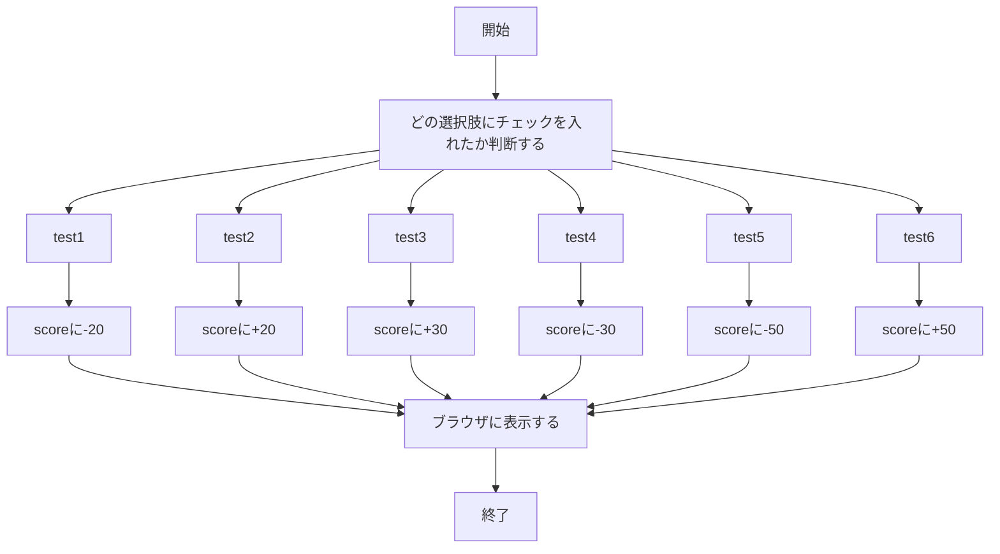
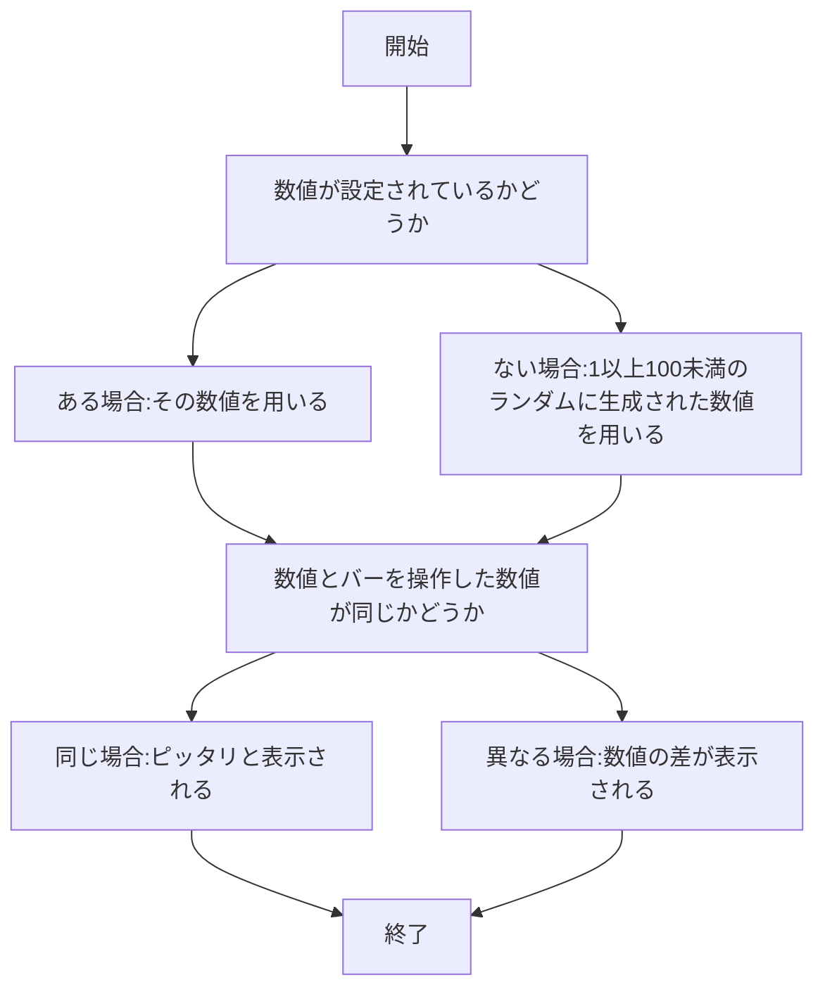

# webpro_06

# #作成したファイルについて
作成したファイルは，
　・question.html
　・question.ejs
　・number.html
　・number.ejs
の以上4つだ．

# #ファイル一覧

ファイル名 | 説明
-|-
app5.js | プログラム本体
public/question.html | 出された問題の選択肢を選ぶ画面
question.ejs |　回答の結果と答えを表示する画面
public/number.html | 開始画面
number.ejs | 指定された数字の位置にバーを動かすための画面

# #作成したファイルの起動方法
・question.html
ターミナルで作業ディレクトリをwebpro_06に移動し，
```
node app5.js
```
を入力し，サーバーを起動する．
そして，ブラウザで
```
http://localhost:8080/public/question.html
```
と入力することで起動することができる．

・number.html
ターミナルで作業ディレクトリをwebpro_06に移動し，
```
node app5.js
```
を入力し，サーバーを起動する．
そして，ブラウザで
```
http://localhost:8080/public/number.html
```
と入力することで起動することができる．

# #作成したプログラムについて
・question.html,question.ejsに関するプログラム
　出題された問題に対して複数の回答が用意されていて，その中から正しい選択肢を選んで高得点を目指すプログラムが作りたかった．複数の選択肢を選択できるようにするため，question.htmlにinput要素の一つであるcheckboxを使用した．checkboxを使用することで，チェックを入れることのできる選択肢を複数作ることができる．
　checkboxは，formの中に
```
<input type="checkbox"
```
そして
```
name="test1" id="1">
<label for="test1">チェック1</label>
```
のようにnameとid，そしてlabelをcheckboxの数だけ設定することで使用できる．
　そしてapp5.jsで'score'を定義し，if関数を用いてチェックを入れた選択肢に応じて'score'に点数を追加するプログラムを作成した．
例の一つとして，以下のように作成した．
```
if( req.query.test1 ) score -= 20;
```
　この'score'を用いて，question.ejsでは回答の点数が何点なのかを
```
<%= score %>
```
と入力して表示するようにした．
以下は上記のプログラムの流れをフローチャートにしたものだ．



・number.html,number.ejsに関するプログラム
　ランダムで選ばれた数値の位置にバーを操作してピッタリを狙うプログラムが作りたかった．バーをブラウザ上で動かせるようにするため，number.ejsにinput要素の一つであるrangeを使用した．rangeを使うことで，バーを操作して数値を入力することができる．
　rangeは，formの中に
```
<input="range" name="range" id="range">
```
のように設定することで使用できる．
　そして，起動する度に数値が変わり，なおかつバーを操作したあとは数値が変わらないようにしたい．そのために，最初にapp5.jsにexpress-sessionパッケージをインポートした．インポートは以下のように入力することでできる．
```
const session=require("express-session")
```
このパッケージをインポートすることで，ブラウザでの一時的なデータ，今回であればランダムに変わる数値を保存できるようになる．
次に，上記でインポートしたものをアプリケーション全体で使えるようにするために設定を行う．設定は以下の事項を入力する．
```
app.use(session({
  secret: '設定する人によって異なる',   
  resave: false,
  saveUninitialized: true,
}));
```
app.use(session({~)はセッションの仕組みを使う，という設定を行うために使用している．そして，secretではセッションを管理するためのキーを設定している．このキーを設定することで，セッションを安全に保護することができる．resaveはセッションが変更されていない場合毎回保存するかどうかを決めるオプションだ．これをfalseにすることで，セッションが変更されていない場合は保存しないようになる．こうすることで無駄な保存を避け，動作を速く行えるようになる．saveUninitializedは，新しく作られたセッションを保存するかどうかを決めるオプションだ．これをtrueにすることで，新しく作られたセッションを保存するようになる．こうすることで，後で別の情報を設定することができるようになる．

最後に，ランダムな数値を作成し，保存するためのプログラムを書く．
プログラムは以下のようにする．
```
if(!req.session.answer){
    req.session.answer = Math.floor(Math.random() * 100 + 1);
  }
```
こうすることで，answerがまだ設定されていない場合にランダムな数値を生成して保存することができる．Math.floorは少数を切り捨てて整数にするために使用している．そしてMath.random() * 100 + 1は，0以上1未満のランダムな整数を100倍することで0以上100未満のランダムな整数が生成される．その整数に+1することで1以上100未満のランダムな整数が生成されるようにした．
　上記の設定と同様に，app5.jsにバーを操作して得た数値"value"とランダムな数値"answer"，そして"judgement"と定義した．定義したものとif関数を用いて，"value"と"answer"の値が同じだった場合"judgement"に"ピッタリ"という文字を追加し，値が異なっていた場合は"value"と"answer"の差を追加するようにした．プログラムは以下のようになっている．
```
const value = req.query.range;
  const answer = req.session.answer;
  let judgement = '';
  if(value == answer) judgement = 'ピッタリ';
  else {
    judgement = value - answer;
  }
```
　上記の"answer"と"judgement"をブラウザ上に表示させるために，number.ejsを作成し，次のようにした．
```
<%= answer %>
<%= judgement %>
```
以下は上記のプログラムの流れをフローチャートにしたものだ．

